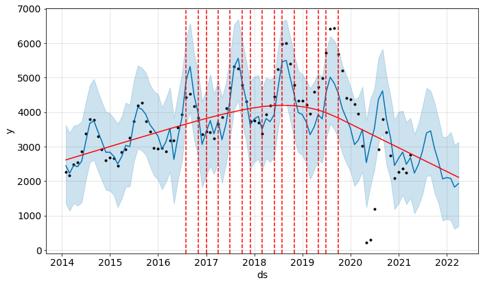
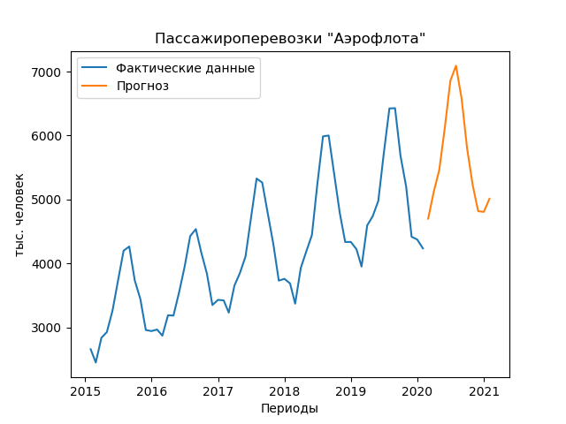

# Прогнозирование пассажироперевозок "Аэрофлота" и поиск аномалий временных рядов

## Использование модели FB Prophet

Пример использования модели FB Prophet для прогнозирования временных рядов с аномальными периодами (резкий спад пассажироперевозок в результате эпидемии коронавируса):
- В файлах "Aeroflot_Prophet_2021.ipynb" и "aeroflot_Prophet_2021.py" - прогноз по данным до марта 2021 г.
- В файле "Aeroflot_Prophet.ipynb" - более ранняя версия прогноза по данным до июля 2020 г.

Как видно по графику, модель идентифицировала точку смены тренда там, где ее на самом деле не было. Уже с 2019 года линия тренда указывает вниз. Фактическое снижение объемов пассажироперевозок началось весной 2020 года, а предшествующий этому год показывал рост операционных показателей. Синяя линия, показывающая моделируемые значения, в 2019 году проходит значимо ниже фактических данных (показаны черными точками), а в 2020 году - выше. Таким образом, модель постаралась найти оптимальное положение, чтобы максимально приблизиться к данным до и после переломного момента, сохранив при этом характерный сезонный рисунок показателя.

Прогноз на 2021-й - начало 2022 года отрицательный. Модель ожидает дальнейшие снижение показателя. На практике динамика пассажироперевозок в будущем будет определяться внешними факторами, которые невозможно предугадать по предшествующей динамике. На этом примере наглядно видно, что применение модели FB Prophet имеет объективные ограничения, и в ситуациях, когда на динамику показателя оказывают влияние внешние факторы (законодательные ограничения, эпидемиологическая ситуация и др.), интерпретировать прогнозы модели следует с осторожностью.

В относительно стабильный период моделируемые значения проходят значительно ближе к фактическим данным. Но при этом, как мы понимаем, прогноз модели на 2020 год с учетом нашего знания о фактических трендах абсолютно нерелевантен.

Для поиска аномалий можно использовать отклонения моделируемых значений от фактических показателей в абсолютном или относительном выражении (в тыс. пассажиров или в долях от единицы). Количество и состав найденных аномалий будут зависеть от выбранного порогового значения отклонений модели от фактических данных, выраженного в стандартных отклонениях от средней ошибки.

На графиках ниже показаны примеры аномалий, найденных за весь доступный период данных (идентифицируются только наиболее критические отклонения) и за сравнительно стабильный период.

Поиск аномалий также может учитывать критические значения, связанные непосредственно с бизнес-логикой рассматриваемой компании. Для этого необходимо иметь сведения о расписании вылетов и максимальной загрузке воздушных судов, а также о минимально допустимой загрузке, при которой операционная деятельность перевозчика все еще остается рентабельной. Постоянное приближение фактических данных к любому из этих критических уровней говорит о том, что необходимо пересмотреть расписание вылетов, увеличить или уменьшить парк экспплуатируемых воздушных судов.

## Использование модели SARIMA

Как и предудыщая модель, SARIMA подходит для прогнозирования показателей с явно выраженными сезонными паттернами. В файлах "Aeroflot_passengers_model_SARIMA.py" и "Aeroflot_passengers_model_SARIMA.py" - прогноз модели SARIMA по данным до января 2020 г. включительно, то есть до начала аномального периода.
На графике ниже показан пример декомпозиции временного ряда на тренд, сезонную составляющую и остаточные колебания.

На графике ACF четко видна 12-месячная цикличность данных по пассажироперевозкам.

Построенный моделью прогноз опирается на предшествующую динамику показателя и, по понятным причинам, как и прогноз модели FB Prophet, радикально расходится с фактическими значениями, которые наблюдались в 2020 году.

## Использование нейронных сетей

В файле "Aeroflot_passengers_model_LSTM.py" - исходный код для создания модели, в файле "Aeroflot_using_saved_model_LSTM.py" - код для повторного использования сохраненной модели и воспроизведения полученных прогнозных значений для тестовой выборки за последний год и на 12 месяцев вперед.

#### Прогнозом на 12 месяцев вперед

#### Фактические и прогнозные показатели пассажироперевозок

Особенности модели:
- Обучение модели производится по данным до начала аномального периода.
- Архитектура нейросети включает два слоя LSTM и один слой Dense.
- При прогнозировании учитываются последние 12 значений временного ряда, прогноз делается на 1 месяц вперед.
- В процессе обучения модели используется инструмент EarlyStopping() для отслеживания точности прогноза на тестовой выборке.
- При достижении высокой точности (MSE < 0,01) модель сохраняется в файл 'best_model.h5'.
- При достижении необходимой точности модели на основе фактических данных за последние 12 месяцев строится прогноз на 12 месяцев вперед: каждое следующее прогнозируемое значение последовательно добавляется к исходным данным для следующего прогноза.

Источник данных: https://ir.aeroflot.ru/ru/reporting/traffic-statistics
