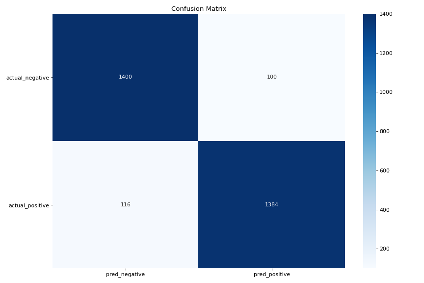

# Определение тональности отзывов о товарах и услугах

Репозиторий содержит примеры кода для решения задачи **бинарной классификации** отзывов о товарах и услугах (sentiment analysis). Исходные данные включают положительные и отрицательные отзывы с **сайтов IMDB, Amazon и YELP**.

## Модели

**В файле "transformers_model.py"** пример использования готовой обученной модели из библиотеки **transformers**. Используется готовый pipeline, что позволяет подавать модели на вход необработанные предварительно тексты. Недостаток модели - значительное время и объемы памяти, необходимые для inference.

На массиве в 3,000 отзывов модель достигает показателей:
- accuracy score = 0.928
- F1 score = 0.93

В файле **"reviews_classification_TF.py"** пример обучения **нейронной сети**, реализованный с использованием библиотеки **TensorFlow**. Модель включает 4 слоя: Embedding, GlobalAveragePooling1D и два полносвязных слоя. Для преобразования исходных текстов в векторы используется Tokenizer из keras.preprocessing.text.

В файлах **"reviews_classification_LogReg.py"** и **"reviews_classification_NB.py"** примеры классификации текста с использованием моделей **Naive Bayes** и **Logistic Regression** из библиотеки **sklearn**. Для преобразования исходных текстов в векторы используется CountVectorizer из sklearn.feature_extraction.text.

## Исходные данные

Файл 'text_to_csv.py' содержит вспомогательную программу, которая преобразует три исходных текстовых файла с отзывами в один общий csv-файл, добавляя в каждую строку информацию об источнике отзыва.

Исходный источник базы данных: https://archive.ics.uci.edu/ml/datasets/Sentiment+Labelled+Sentences

База данных была создана для работы: "From Group to Individual Labels using Deep Features", Kotzias et. al,. KDD 2015.
База данных содержит отзывы о товарах, кинофильмах и ресторанах, относящиеся к двум категориям (негативные и позитивные).

Форматирование: sentence \t score \n

Расшифровка категорий: 1 - позитивная оценка, 0 - негативная оценка.

Отзывы собраны с трех сайтов:
 - imdb.com
 - amazon.com
 - yelp.com

В базе содержится по 500 негативных и 500 позитивных отзывов с каждого из трех сайтов.
Отзывы отобраны случайным образом из более обширной выборки.
Отбирались явно положительные и явно отрицательные отзывы, нейтральные отзывы исключались.
