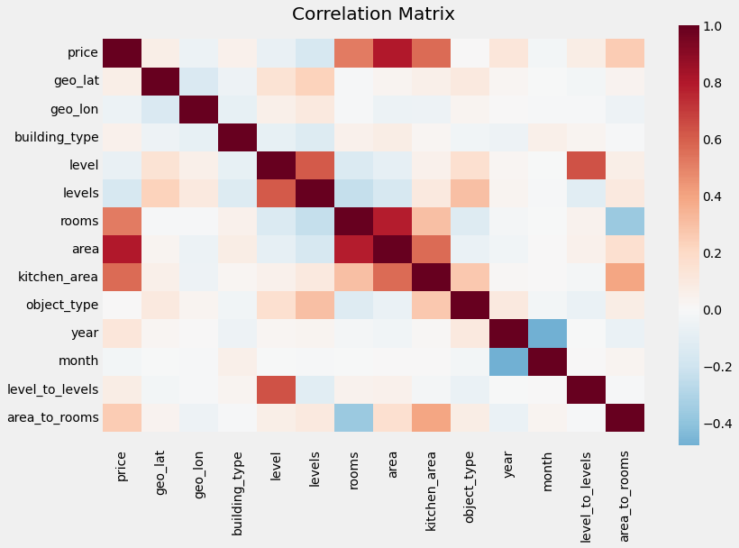
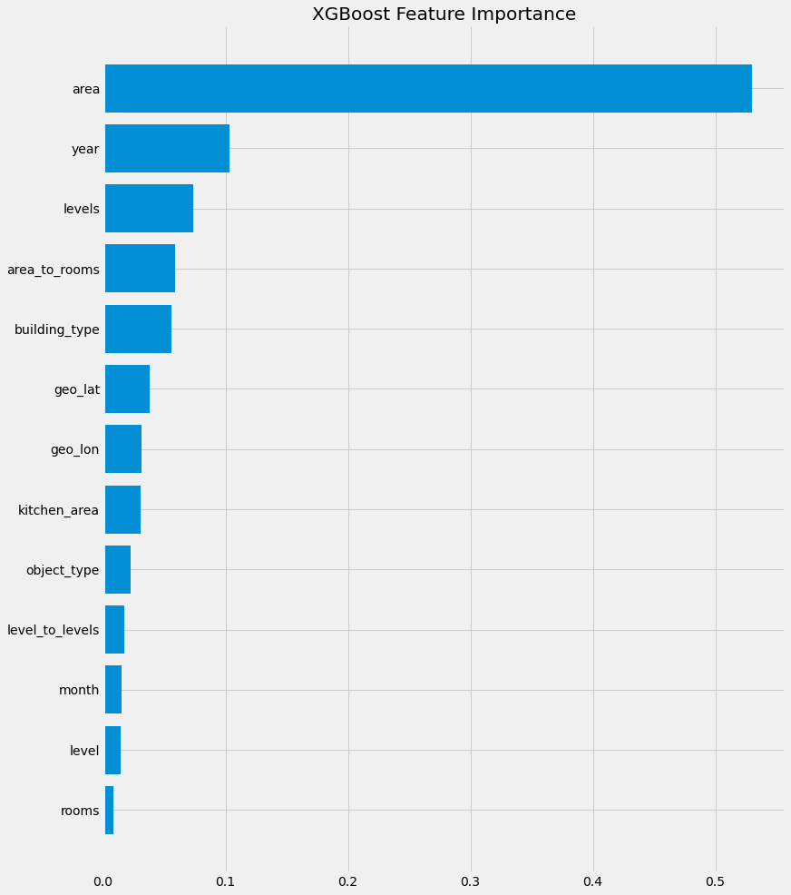
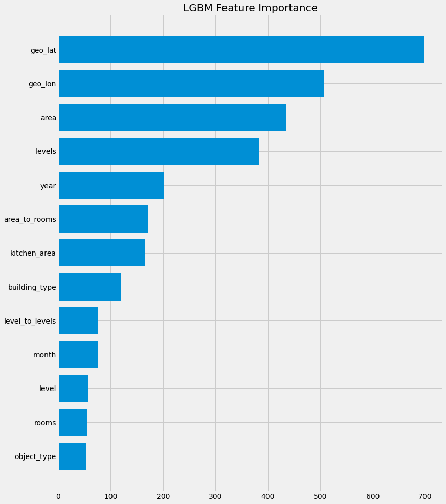
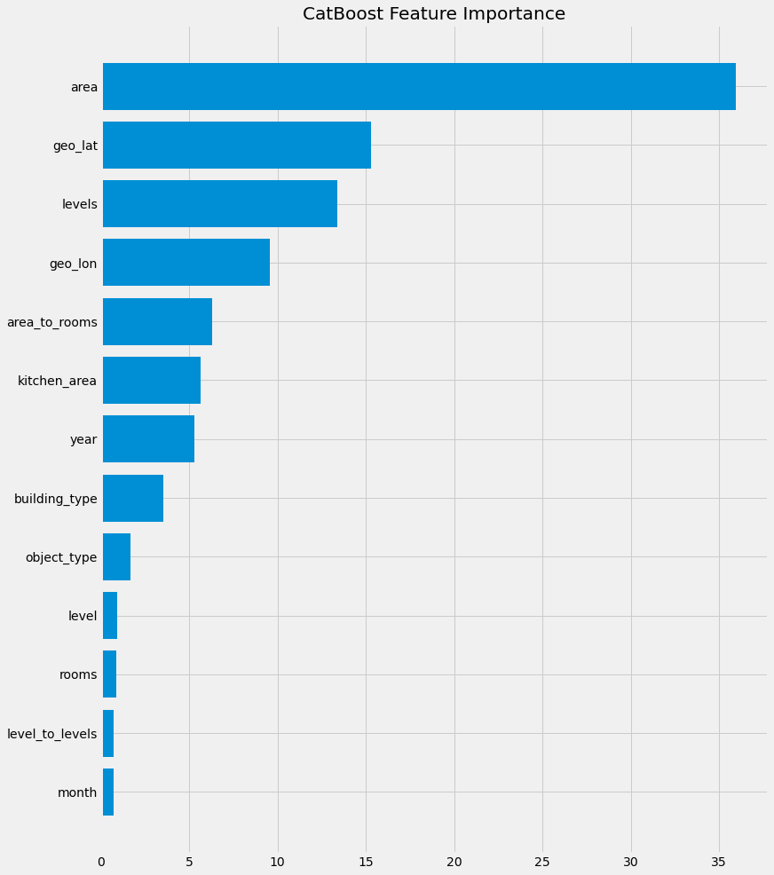
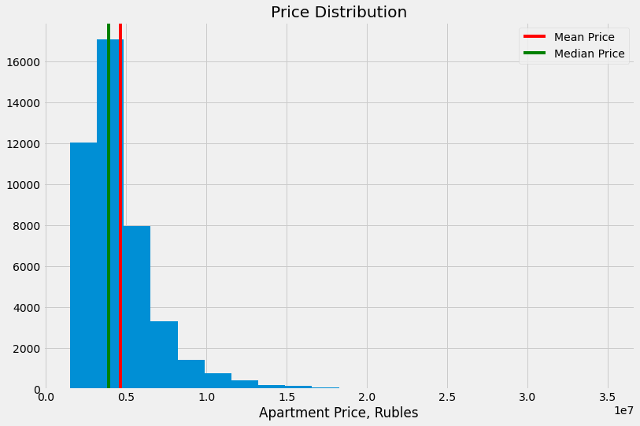

# Apartment Evaluation Models

This repository contains code for training apartment pricing (evaluation) models based on **Gradient Boosting** regression and **Nearest Neighbours** search.

Data source: https://www.kaggle.com/mrdaniilak/russia-real-estate-20182021/

**Models used:** XGBoost, LGBM, CatBoost, sklearn NearestNeighbours

**Techniques applied:** data cleaning, filtering outliers, feature engineering

Data set contains listings for Russian Housing from 2018 till 2021 across different regions, a total of 5,477,006 samples with 12 features and a target value ("price").

**Features:**
- 'date' - date the listing was published
- 'time' - exact time the listing was published
- 'geo_lat' - geographical coordinate of the property
- 'geo_lon' - geographical coordinate of the property
- 'region' - numerically encoded geographical area
- 'building_type' - numerically encoded type of the building where the apartment is located
- 'level' - floor the apartment is located on
- 'levels' - total number of storeys in the building
- 'rooms' - number of rooms in the apartment (-1 stands for studios with open-space layout)
- 'area' - total floor area of the apartment in sq. meters
- 'kitchen_area' - kitchen area in sq. meters
- 'object_type' - apartment type, where 1 stands for secondary real estate market, 11 - new building

In data cleaning phase I enforce correct data types, remove excessive information like exact time the listing was published, remove or correct price and area outliers. For filtering purposes I limit the floor area to a range between 20 sq.m and 200 sq.m and price to a range between 1.5 mln to 50 mln rubles, which covers most of the housing market. For model training I use a subset of data representing Saint Petersburg region.

In feature engineering step I introduce two temporal features (year and month of the listing publishing) and two numeric ratios (ratio of floor area to a number of rooms and ratio of floor to total number of floors in the buiding). The rationale behind this is that more spacious rooms usually indicate that the apartment belongs to a more prestigious and upper-tier residential area. Apartments on upper floors are more expensive but the price also depends on the total number of floors: 5th floor in a 25-storey building is not the same at 5th floor in a 5-storey building.

## Gradient Boosting Results

Original implementation: https://www.kaggle.com/ekaterinadranitsyna/russian-housing-evaluation-model

**Standard deviation of price** in the selected subset of data representing Saint Petersburg housing market is about **5.6 mln rubles**.

**Models performance (5-fold validation RMSE):**
- CatBoost - 1.736 mln rubles
- XGBoost - 1.796 mln rubles
- LGMM - 1.944 mln rubles

Models assigned different importances to input features, which implies that a combination of several models could make predictions more reliable.

There is still room for improvement taking into account that median price in the city is about 6 mln rubles. However without additional features making these models significantly more accurate would be difficult. A number of important features are missing in this data set:
- Condition: similar apartments would be priced differently, if one of them is being sold fully furnished in excellent condition and the other is being sold without finishing.
- Ceiling height affects the price.
- Balconies and terraces increase the price compared to similar apartments without such amenities.
- Additional unique properties usually mentioned in the description of the apartment, like chimneys or underground parking spaces, affect the price.

## Nearest Neighbours Results

Original implementation: https://www.kaggle.com/ekaterinadranitsyna/price-analogues-retrieval

Evaluation approach based on analogues retrieval was tested using a randomly selected region from the data set. For each apartment type (studio, 1-room, 2-room, etc.) a separate model was trained with number of neighbours set to 10.

**Market statistics:**
- Price range: 1,500,000 - 35,000,000
- Mean price: 4,637,269
- Median price: 3,900,000
- Standard deviation: 2,463,239

**Nearest Neighbours Model Performance:**
- Average MAE for all apartment types: 403,684
- Average RMSE for all apartment types: 786,381
- MAE / std ratio: 0.16
