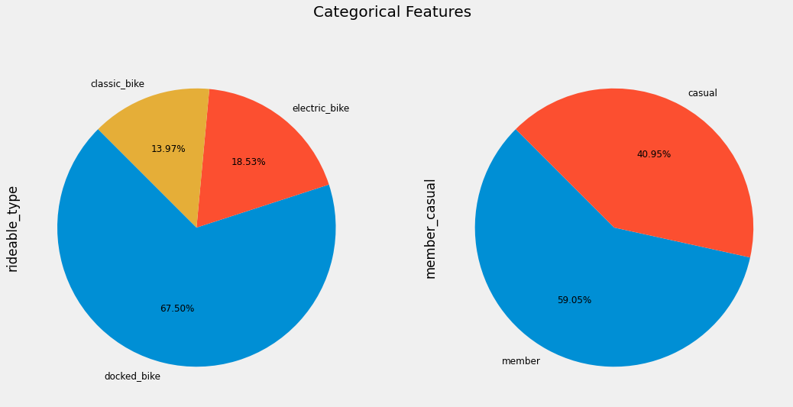
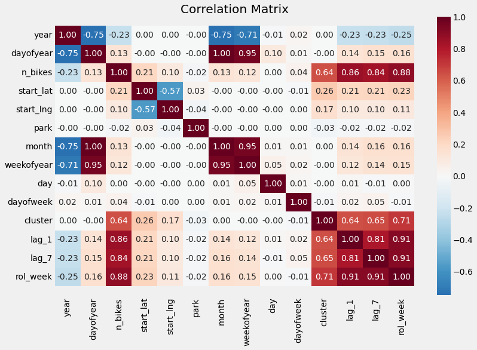
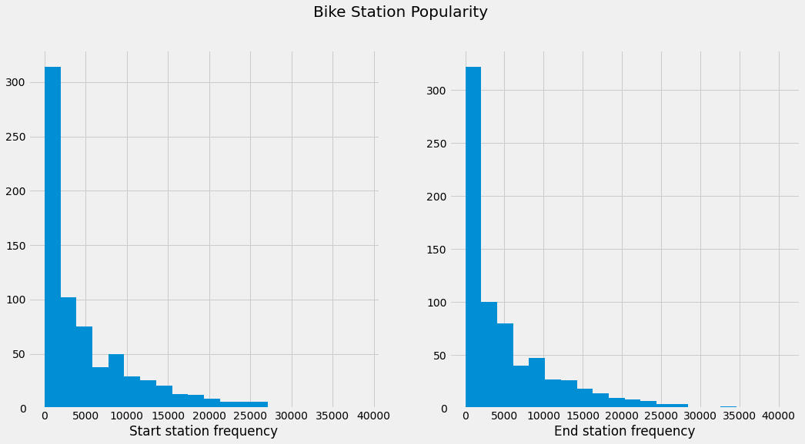
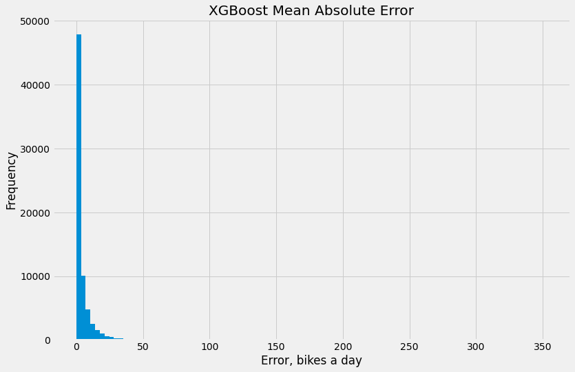
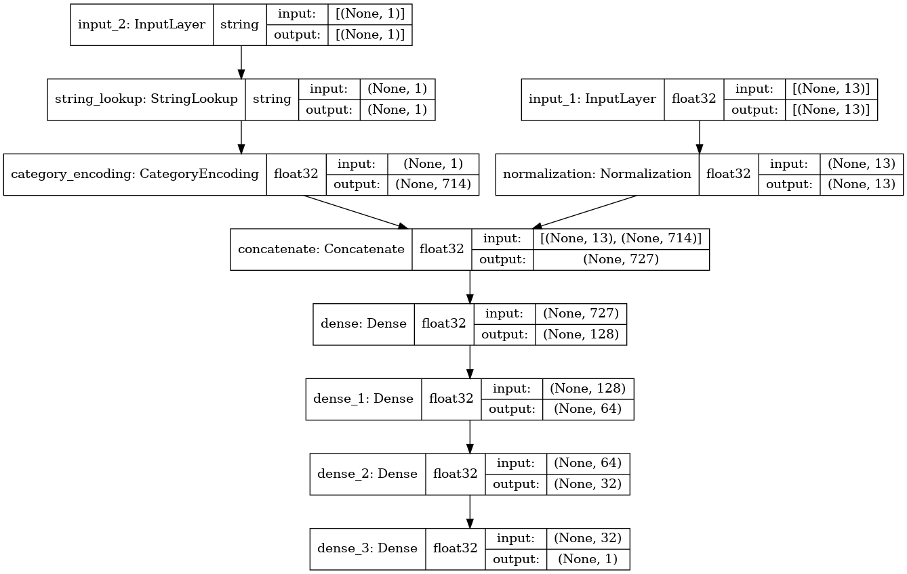
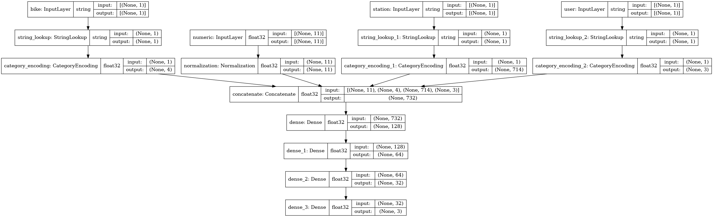

# Predict Demand and User Behaviour at a Bike Sharing Service
# (Прогнозирование спроса на аренду велосипедов)

My Kaggle notebook with data analysis and models: https://www.kaggle.com/ekaterinadranitsyna/city-bike-sharing

Data set contains description of **bike rides in Chicago** for a period **from April 2020 till April 2021** - a total of **3,826,978 samples** and **713 bike stations**. Each sample contains start and end station name, ID, latitude, longitude, time, bike type and user category. User ID is not available.

#### With the available data we can solve several tasks:
- Predict total number of bikes rented at each bike station daily. Input features include location, temporal features, categorical features defining station type and demand in previous periods.
- Predict ride duration and end point coordinates for each individual ride. Input features include location, temporal features, categorical features defining bike type, user type and station type.

Categorical features of the data set include bike type, user category and station name.

#### Feature engineering:
- Based on the date and time of each ride several temporal features could be created: year, month, week of year, day of year, day of month, day of week and hour.
- Based on the the total number of bikes rented at the bike stations we can group stations into clusters that would reflect their overall popularity.
- Based on the number of bikes rented at each station daily we can create features based on lagged and rolling target values.
- Based on the station name we can create a binary feature indicating proximity to park.

The image below shows correlation matrix for the features and the target "n_bikes" (which stands for number of bikes rented daily at each individual station).

For most bike stations daily demand does not exceed 10-20 bikes a day. However, at some locations the demand is much higher and increases significantly in high summer season.

#### Models:
- **XGBoost regression model** for predicting **daily demand for bikes at each station**. For this model we drop station names assuming that geographical coordinates, station clusters, temporal features and lagging target values will be enough to predict daily bike rents. Validation MAE = 4.3.

- **TensorFlow neural networks:**
  - **Daily demand model.** For this model we can use stations names as a categorical feature without any concern about the dimensionality of the input data. Other original and engineered features also can be used. The model takes 2 inputs: an array of numerical features and an array with categorical values for station name and outputs a single value - expected number of bikes rented at this station on a given day. Validation MAE = 4.39.

  - **User behaviour model.** The model takes 4 inputs: array of numerical features and 3 arrays of categorical values (for bike type, station name and user category) and outputs an array that contains 3 values: expected ride duration in minutes, predicted end point latitude and longitude. Rent duration is predicted with a MAE = 11.5 minutes. End point latitude MAE = 1.4. End point longitude MAE = 0.84.

