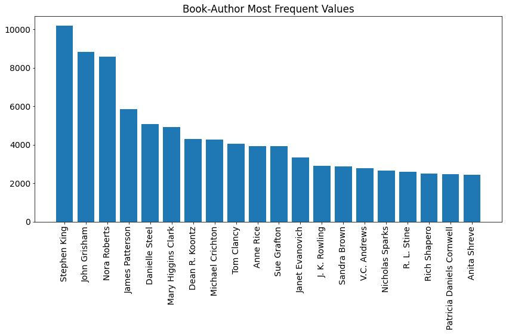
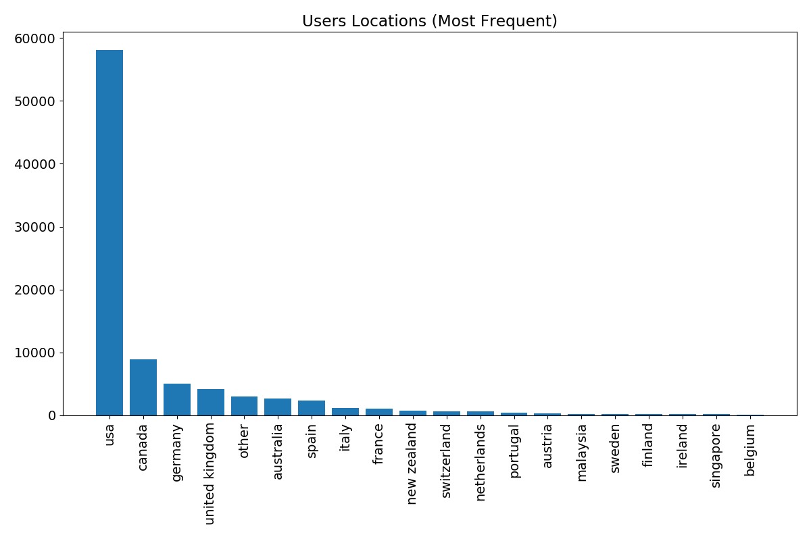
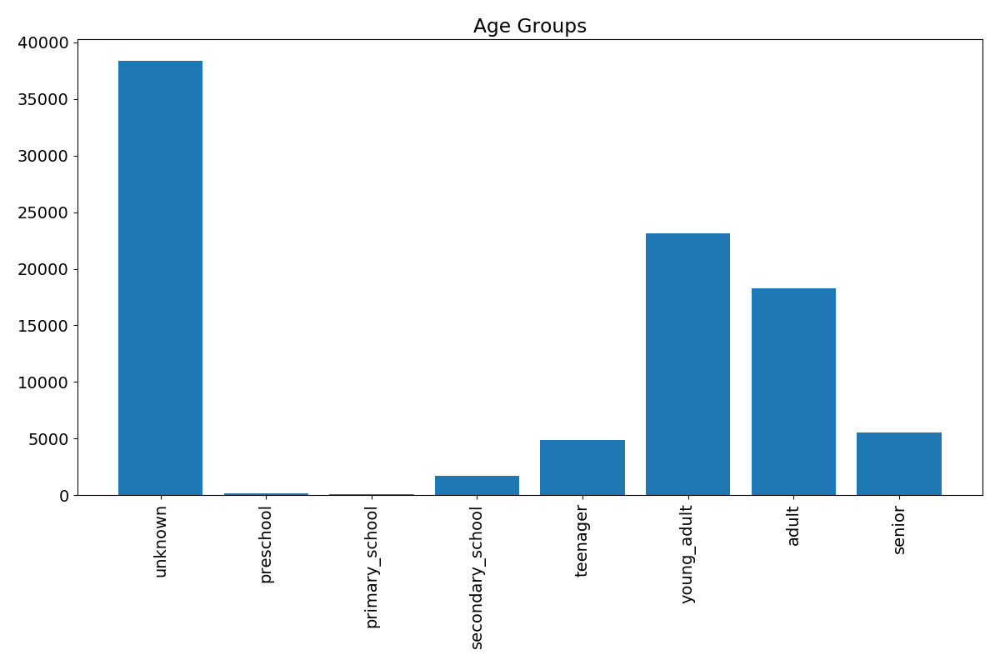

# Рекомендательные алгоритмы для книг

Исходные данные взяты с платформы Kaggle (https://www.kaggle.com/arashnic/book-recommendation-dataset) и включают 3 csv-файла ("Books.csv", "Users.csv" и "Ratings.csv"). Данные включают ID пользователя, возраст и локацию, автора книги, заголовок, издателя, год публикации, ISBN, рейтинг (от 1 до 10 или 0, если пользователь по поставил рейтинг), URL-ссылки на обложки книги в трех размерах.

### Используемые алгоритмы:
- **Общие рекомендации на основе выбора большинства** (количество прочтений и средний рейтинг книги среди всех групп пользователей)
- **Рекомендации на основе укрупненных когорт** (количество прочтений и средний рейтинг книги с учетом возрастной группы и страны проживания пользователя)
- **Рекомендации на основе предшествующей истории пользователя** (рекомендуются непрочитанные пользователем книги авторов, которых он читал ранее)
- **Рекомендации на основе семантического сходства заголовков** (векторизация заголовков с применением модели **"DistilRoBERTa base v1"**):
  - из истории пользователя выбираются книги с наиболее высокими рейтингами
  - для них подбираются семантически схожие заголовки, где косинусное сходство находится в пределах от 0.75 до 0.95
- **Векторизация пользователей и поиск схожих по предпочтениям и атрибутам:**
  - подсчитывается количество прочтений каждым пользователем 2000 наиболее популярных авторов
  - добавляется столбец "прочие", в который суммируются прочтения всех других авторов
  - полученные данные для каждого пользователя нормируются на общее количество прочтений для получения 1D-вектора распределения предпочтений
  - к вектору предпочтений добавляются кодировки возрастной группы и локации пользователя (One-Hot-Encoding)
  - на основе косинусного сходства определяются наиболее похожие пользователи
  - рекомендуются непрочитанные пользователем книги, которые читали похожие на него пользователи
- **Collaborative filtering** с использованием библиотеки **fastai** для оценки возможного рейтинга книг:
  - отбрасываются строки, содержащие рейтинг 0 (пользователь прочитал книгу, но не поставил рейтинг)
  - оставшиееся данные делятся на учебную и валидационную выборку в соотношении 90%/10%
  - коллаборативная модель обучается в течение 5 эпох
  - достигается средняя ошибка на учебной выборке 2.0 балла и на валидационной выборке 3.8 балла

### Атрибуты пользователей

### Предварительная обработка данных

- Исправление опечаток и технических ошибок в исходных данных, обработка "выбросов"
- Реиндексация книг по уникальным сочетаниям заголовков и авторов (ISBN, содержащийся в исходных данных, уникален для каждого издания книги, поэтому одна и та же книга, изданные в разные периоды, может иметь разные коды)
- Объединение данных в общий pd.DataFrame
- Составление словаря для быстрого поиска имени автора и названия книги по уникальным индексам

Все алгоритмы реализованы в формате функций с настраиваемыми параметрами поиска.

Мой ноутбук на Kaggle: https://www.kaggle.com/ekaterinadranitsyna/book-recommender
