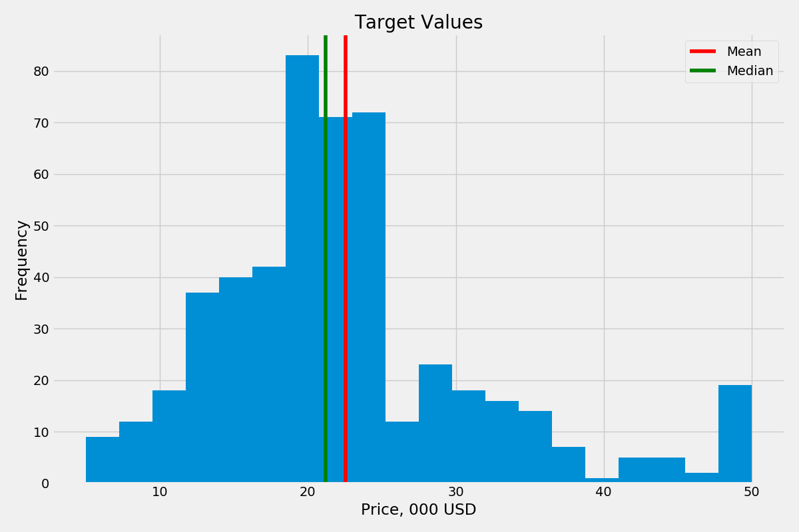
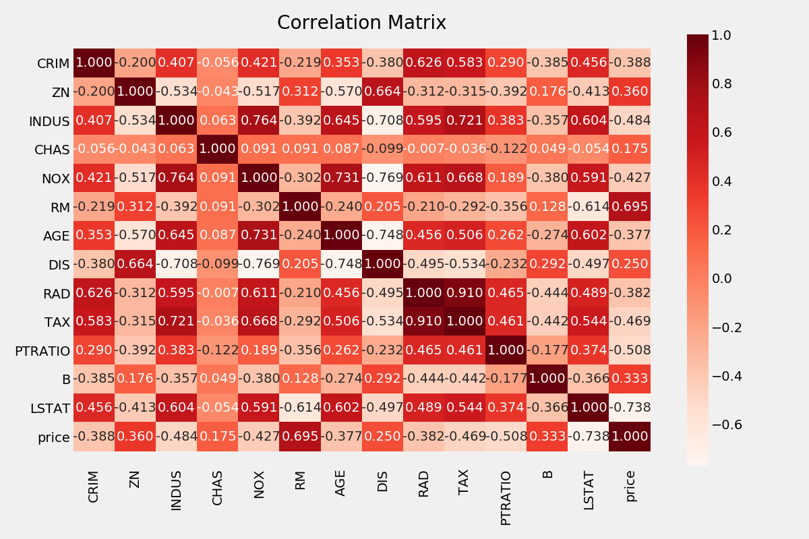
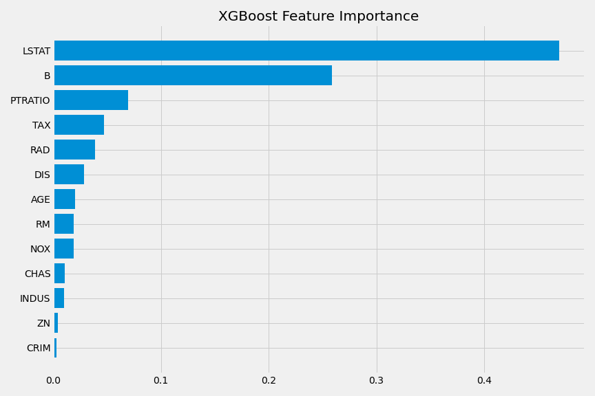
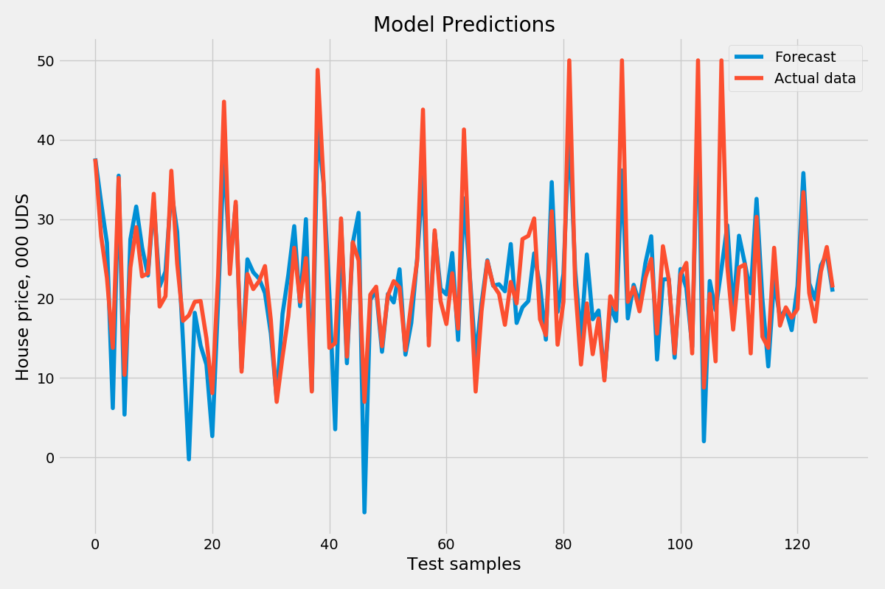
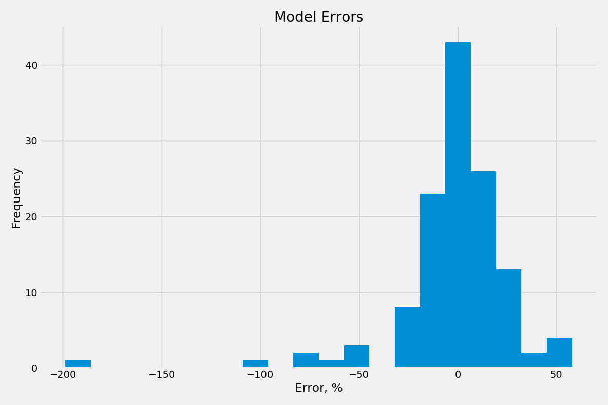
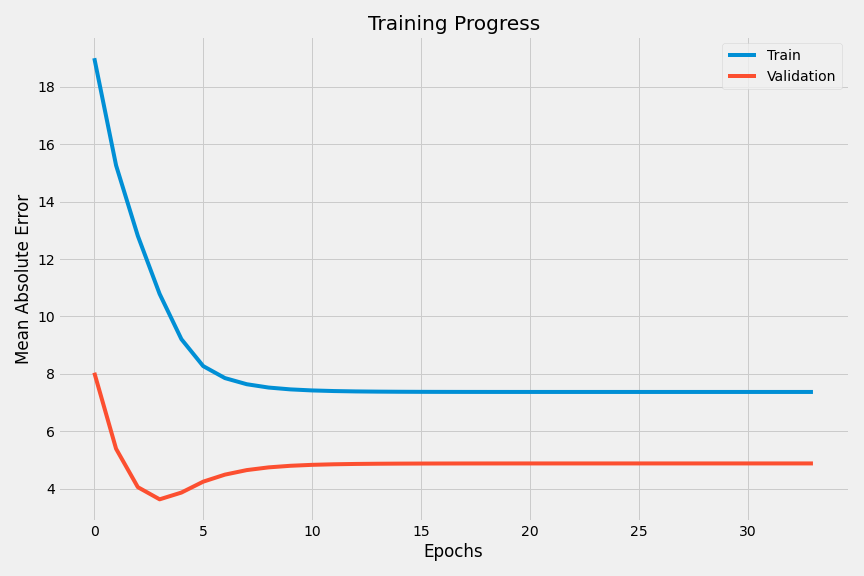

# Модели для оценки медианной стоимости жилого дома
# (Median House Price Model)

Примеры применения регрессионных моделей XGBoost, LinearRegression и нейронной сети для прогнозирования стоимости домовладения на основе данных Boston dataset.

(Examples of applying XGBoost regression model, linear regression model and a neural network to predict the house price using Boston dataset.)

Распределение прогнозируемых значений:

Корреляция параметров с прогнозируемой величиной - стоимостью дома:

Наиболее высокую точность показала модель XGBoost (best performing model):
- MAE = 2.2584978854562348
- MSE = 8.624804820850715
- RMSE = 2.93680180142459

Результат модели линейной регрессии (linear regression model):
- MAE = 3.2900183526885503
- MSE = 24.274608311687857
- RMSE = 4.926926862831217

Результат нейронной сети (neural network):
- MAE: 3.6274964809417725
- MSE: 21.07403564453125
- RMSE: 4.590646538836469

### Датасет (Dataset description)
- 506 примеров (506 samples)
- 13 числовых параметров (13 numerical features)
- Прогнозируемая переменная - медианная стоимость объекта (target value - median price)

**Расшифровка параметров:**
1. CRIM: уровень преступности на душу населения;
2. ZN: доля земельных участков жилого назначения площадью более 25 000 кв. футов;
3. INDUS: доля земельных участков, занимаемых предприятиями не из сферы торговли;
4. CHAS: близость к реке Charles River (1 - если граничит с рекой, 0 - нет);
5. NOX: концентрация оксидов азота (частиц на 10 миллионов)
6. RM: среднее количество комнат в доме;
7. AGE: доля объектов в собственности, построенных до 1940 г.;
8. DIS: расстояние до ближайшего центра занятости;
9. RAD: индекс доступности радиальных автомагистралей;
10. TAX: величина налогов на $10 000 стоимости дома;
11. PTRATIO: соотношение учеников и учителей в школах;
12. B: доля темнокожего населения;
13. LSTAT: доля низшего класса в структуре населения;
14. MEDV: медианная стоимость домов в собственности, тыс. долл. США.

**Attributes**
1. CRIM per capita crime rate by town
2. ZN proportion of residential land zoned for lots over 25,000 sq.ft.
3. INDUS proportion of non-retail business acres per town
4. CHAS Charles River dummy variable (= 1 if tract bounds river; 0 otherwise)
5. NOX nitric oxides concentration (parts per 10 million)
6. RM average number of rooms per dwelling
7. AGE proportion of owner-occupied units built prior to 1940
8. DIS weighted distances to five Boston employment centres
9. RAD index of accessibility to radial highways
10. TAX full-value property-tax rate per $10,000
11. PTRATIO pupil-teacher ratio by town
12. B 1000(Bk- 0.63)^2 where Bk is the proportion of blacks by town
13. LSTAT % lower status of the population
14. MEDV Median value of owner-occupied homes in $1000's
