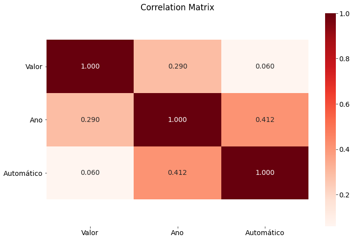
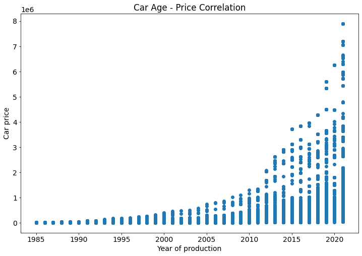
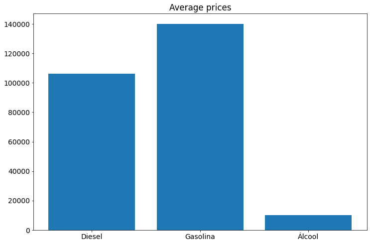
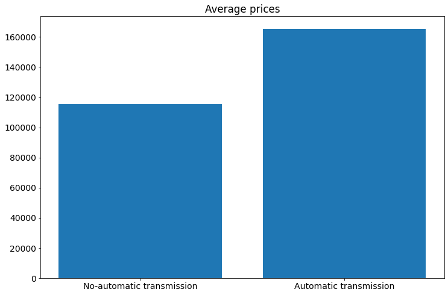
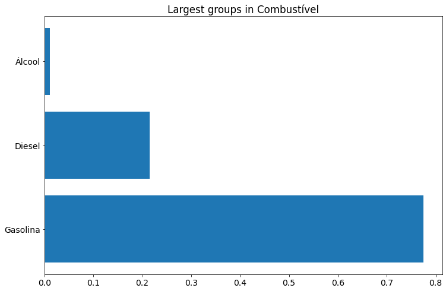
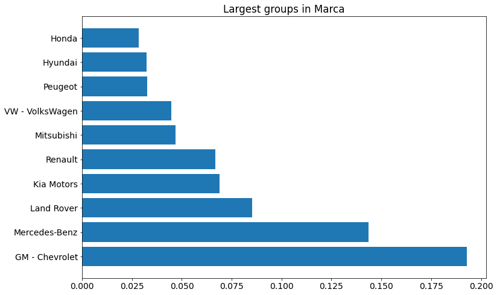
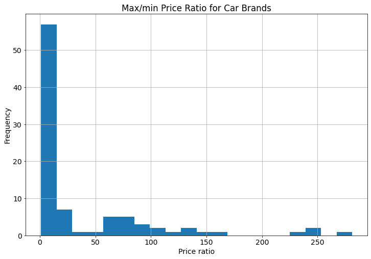
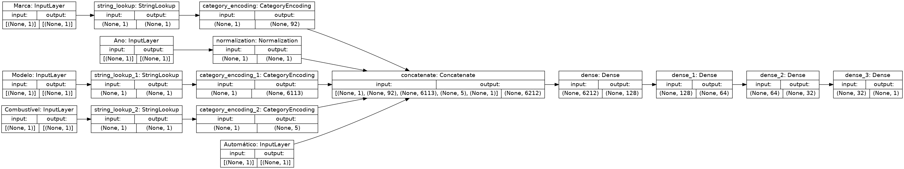
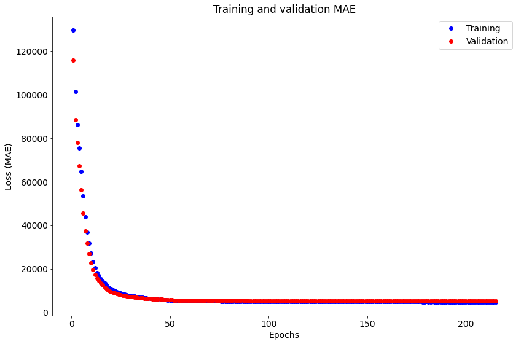

# Нейронная сеть для оценки стоимости машин

Исходные данные в формате csv включают числовые и категорийные параметры для более чем 171 тысяч автомобилей 90 различных марок. Источник данных: https://www.kaggle.com/victorsoeiro/brazilian-vehicle-prices-july-2021-fipe

Мой ноутбук на Kaggle: https://www.kaggle.com/ekaterinadranitsyna/car-pricing-model

### Анализ данных

Исходные данные включают следующие параметры:
- марка автомобиля
- модель
- тип двигателя
- год выпуска
- наличие автоматической коробки передач
- стоимость

Данные о состоянии автомобиля и пробеге отсутствуют.

В выборке представлены автомобили **90 различных марок** и **6198 моделей**. Преобразование исходных данных в векторный формат (one-hot encoding) приводит к созданию векторов большой размерности, что не позволяет использовать классические модели машинного обучения. Отказ от использования марки автомибиля в наборе входных данных снижает точность. Это предопределило использование нейронной сети для оценки стоимости машин.

Числовые параметры демонстрируют умеренную корреляцию со стоимостью машин.

Категорийные параметры (марка и модель автомобиля, тип двигателя) оказывают значительное влияние на стоимость.

При этом автомобили разных типов и марок представлены в выборке неравномерно.

Разброс цен крайне широк для большинства марок автомобилей всех ценовых категорий. Узкий ценовой диапазон встречается у марок, представленных в выборке в ограниченном количестве экземпляров. Для иллюстрации этого феномена на диаграмме ниже показано распределение отношения максимальной стоимости к минимальной стоимости для всех 90 марок. Это отношение варьирует от 1.05 до 281, среднее значение - 37.9, медиана - 8.01.

### Модель

Для определения стоимости автомобиля используется нейронная сеть, состоящая из следующих блоков:
- Входные слои - отдельно для числовых и категорийных параметров
- Для предварительной обработки данных используются слои keras (Normalization, CategoryEncoding)
- Полносвязные слои с регуляризацией
- Финальный слой с 1 нейроном для прогноза стоимости

### Результаты

По итогам тестирования моделей различных конфигураций была выбрана модель с тремя полносвязными слоями на 128, 64 и 32 нейрона и оптимизатор Adam с базовыми параметрами. Взвешивание данных при обучении модели с учетом различий в количестве автомобилей разных типов не повысило точность на тестовой выборке и в финальной версии не использовалось.

**Лучший результат:**
- MAE (тестовая выборка) - 5710
- MAE (валидационная выборка) - 5200
- MAE (учебная выборка) - 4834

Отношение средней абсолютной ошибки модели к средней стоимости автомобиля **не превышает 5%**.

**Погрешность модели**
- Средняя стоимость автомобиля в выборке - 131,482
- Медианная стоимость автомобиля в выборке - 43,519
- MAE / Mean price: 0.043
- MAE / Median price: 0.131

