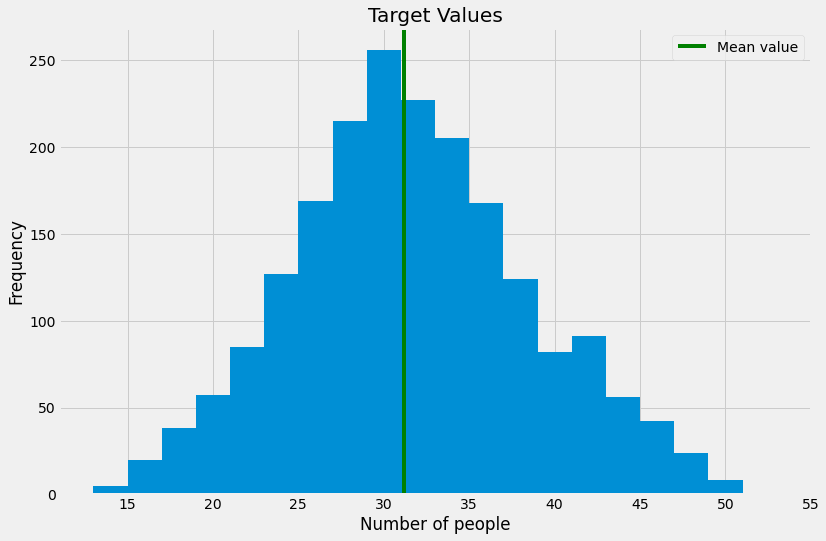
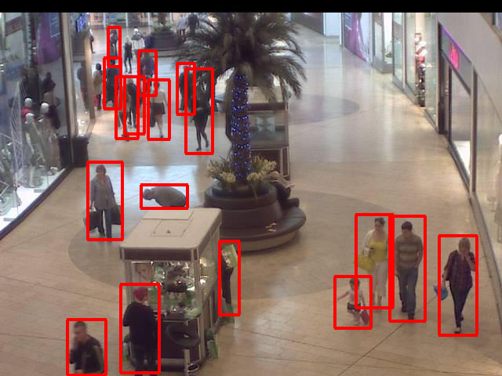
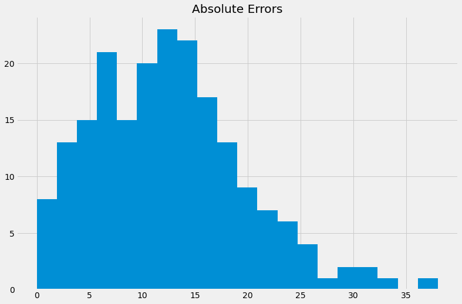
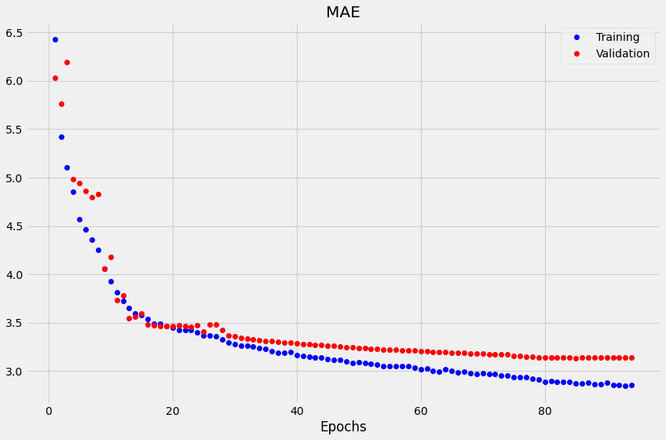

# Crowd Detection Model
# (Оценка количества людей в торговом центре)

This repository contains code examples to automatically count the number of people in a shopping center using images from indoor video cameras. (Репозиторий содержит примеры использования моделей для идентификации и подсчета количества людей на фотографиях из торгового центра.)

Kaggle notebook: https://www.kaggle.com/ekaterinadranitsyna/crowd-detection-model/

Original data contains **2,000 images** taken from a video camera inside a shopping center. The task is to predict **the number of people in an image**. Image size is **480 x 640 pixels**. Target values vary **between 13 and 53 with a mean of 31.16**. Values are normally distributed with the median value close to the mean.

## Out-of-the-box solution (использование готовой модели)

**EfficientDet object detection model** loaded from **TensorFlow Hub**. The model is capable of detecting a wide range of objects returning predicted class, bounding box coordinates and confidence score for each object. Benefits: doesn't require training, multiple models are available, could be easily deployed on various devices. Drawbacks: model is prone to errors when detecting multiple objects, objects partly occluded or located at the background, model is difficult to retrain and fine-tune.

#### Algorithm
- Extract example images from .jpg files and convert to tf.Tensor without resizing or preprocessing.
- Visualize model predictions overlaying predicted bounding boxes over the example images.
- Select the minimum confidence score to improve the model accuracy.
- Check the accuracy on randomly selected subset of images:
  - EfficientDet model cannot process batches of images, so we process them one by one using multiprocessing for time optimization.
  - Postprocess the model output for each image counting the number of objects identified as "person" with a selected confidence threshold.

**Model accuracy:**
- MAE = 12.5
- MSE = 206.9

Out-of-the-box solution cannot be used for this task. The model is good at detecting objects at the foreground and middle of the image and fails at "counting" numerous objects of the same class located all over the image. Despite the attempts to improve performance by applying thresholds to confidence scores, the error rate is high.

## Transfer learning

**InceptionResNetV2** as feature extractor with a **new regression head**. Benefits: model is relatively easy to fine-tune for a new task while retaining the useful knowledge of the original classifier. Drawbacks: despite higher accuracy compared to the previous solution, this model is not perfect and could not be used in environments where high precision is important.
We will load InceptionResNetV2 model from Keras applications and freeze the original weights. The model will be trained with a new regression head. The learning rate will be adjusted whenever validation loss is getting worse.

The original model was trained on images of size 299 x 299. We resize the images accordingly using padding to avoid distorting the objects. To compensate for small number of training samples we will apply various image augmentation techniques randomly changing brightness, contract, saturation and hue and flipping the images left-to-right.

**Model accuracy:**
- MAE = 3.14
- MSE = 16.13

