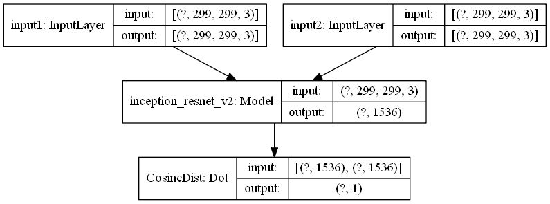
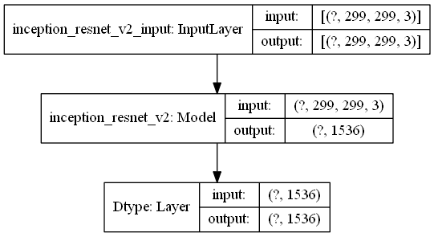

# Определение степени сходства изображений

В директории собраны примеры моделей на основе нейронных сетей, которые могут использоваться для определения степени сходства между двумя или несколькими изображениями или для поиска идентичных изображений в массиве.

**В файле "image_pairs.py" модель, обрабатывающая пары изображений**. В ее основе - обученная модель **InceptionResNetV2**, используемая для преобразования исходных картинок в одномерные массивы (feature extraction).

Особенность модели в том, что она имеет два самостоятельных входных слоя и таким образом может принимать на вход сразу два изображения. После feature extraction полученные массивы проходят через дополнительный слой Dot, где производится расчет cosine similarity.

Такую модель целесообразно использовать в тех случаях, когда стоит задача попарного сравнения изображений. Модель преобразует каждую пару изображений в одно значение от 0 до 1 (значения, близкие к 1, означают максимальное сходство) и не сохраняет значения извлекаемых фичей, что экономит память и позволяет обрабатывать не ограниченные по объему массивы из пар снимков.

**В файле "collection_of_images.py" модель, обрабатывающая изображения поштучно.** Модель преобразует каждое изображение из исходного списка файлов в одномерный массив. Для экономии памяти к базовой конфигурации **InceptionResNetV2** добавлен дополнительный слой без активации, задача которого - преобразовать выходные данные модели в тип float16, не изменяя их значения.

Полученные фичи для всего массива исходных изображений сохраняются в переменную и могут использоваться для последующих сравнений:
- Произвольное сравнение пар изображений (фичей), извлекаемых из сохраненного массива по индексам, с использованием слоя Dot
- Составление матрицы расстояний (cosine distances) всех изображений со всеми с использованием scipy.spatial.distance_matrix
- Индексирование всего массива для поиска пар наиболее схожих фотографий с использованием scipy.spatial.cKDTree

