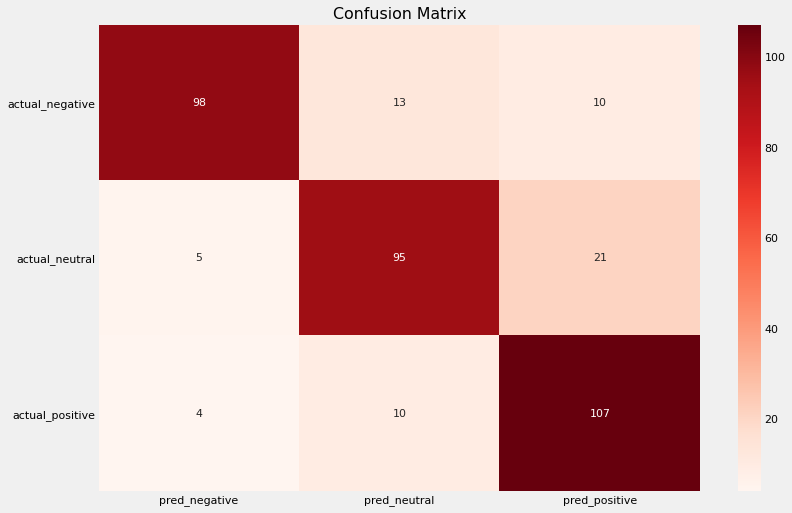

# Модель для классификации тональности финансовых новостей

Задача - разработка модели классификации для автоматической обработки текстов информационных сообщений и новостей деловой тематики и прогнозирования изменений в поведении розничных инвесторов.

На основе датасета из 5 тыс. фрагментов текстов производится тестирование моделей классификации из библиотеки sklearn:
- MultinomialNB
- LogisticRegression
- SGDClassifier

Основная сложность в решении задачи - дисбаланс классов. В датасете представлены 3 категории: негативные, нейтральные и позитивные новости. Нейтральные новости, наименее интересные с точки зрения анализа тональности, преобладают над остальными классами. Негативные новости, наиболее сильно влияющие на поведение инвесторов, составляют 12,5% от общей выборки.

При работе с полным массивом данных оценка моделей на тестовой выборке показала низкую точность в определении классов, на которые приходится наименьшее количество образцов текста.

Для улучшения качества моделей были опробованы различные подходы:
- стратификация данных при разбиении датасета на учебную и тестовую выборку;
- использование параметра, балансирующего веса классов при обработке данных моделью;
- балансировка классов в исходных данных.

Наилучший результат был показан моделью SGDClassifier при работе на предварительно сбалансированных данных:
- Accuracy score - 0.83
- Precision - от 0.78 до 0.92 (в зависимости от класса)
- Recall - от 0.79 до 0.88 (в зависимости от класса)

Использование GridSearchCV не улучшило показатели моделей. Оптимальным способом доработки классификаторов было бы расширение тестовой выборки за счет дополнительных примеров текстов негативной и позитивной тональности и обучение модели на сбалансированном датасете.

Мой исходный ноутбук на Kaggle: https://www.kaggle.com/ekaterinadranitsyna/finnews-sentiment-for-retail-investors
