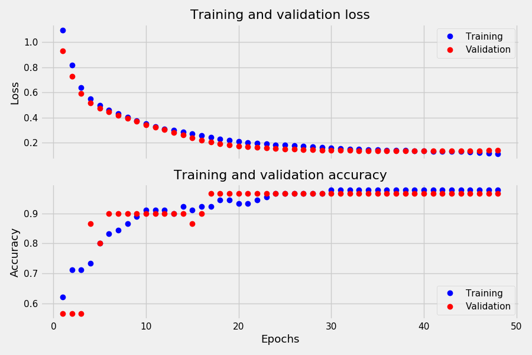
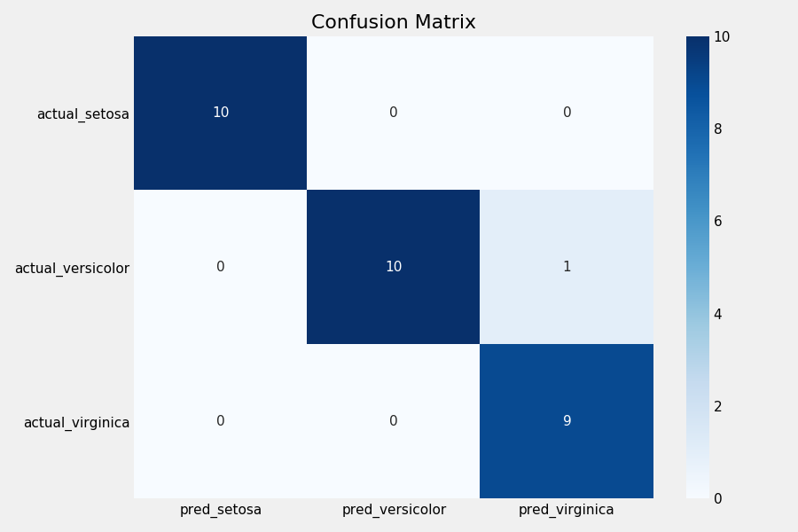

# Модели классификации данных "iris dataset"

### Нейронная сеть

В файле "iris_classification_TF.py" - нейронная сеть, реализованная с применением библиотеки TensorFlow. Модель включает несколько полносвязных слоев с разными функциями активации (relu, selu) и регуляризацией весов и финальный слой с функцией softmax. Для автоматической остановки процесса обучения используется инструмент callbacks.EarlyStopping.

С учетом небольшого объема исходных данных модель достаточно быстро достигает высоких показателей точности на валидационной выборке.

При тестировании модели на тестовой выборке результаты могут несколько отличаться, но в большинстве случаев точность находится в диапазоне от 0.97 до 1.00.

### Классификаторы sklearn

В остальных файлах формата .py - примеры использования моделей из библиотеки sklearn:
- Поиск оптимальной величины k при использовании модели на основе алгоритма K Nearest Neighbors
- Поиск оптимальной величины тестовой выборки при использовании модели на основе Logistic Regression
- Использование инструмента кросс-валидации для выбора оптимальной модели
- Использование инструмента GridSearchCV для настройки параметров модели ("n_estimators" для RandomForestClassifier)
- Выбор оптимальной модели из ансамблей деревьев с использованием кросс-валидации, оценки точности на тестовой выборке и настройки гиперпараметров через RandomizedSearchCV
