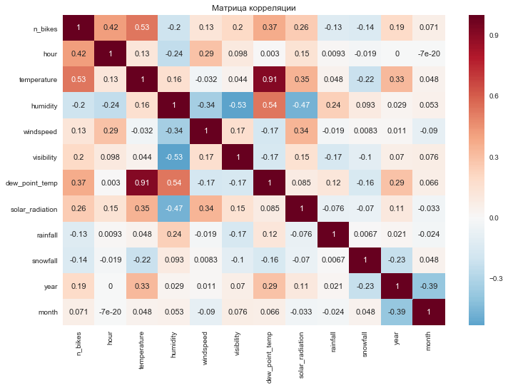
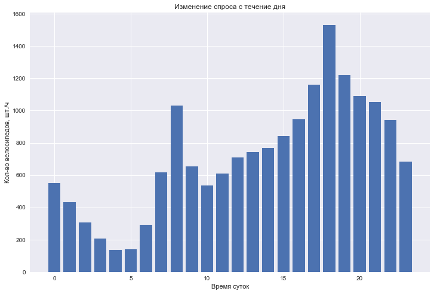
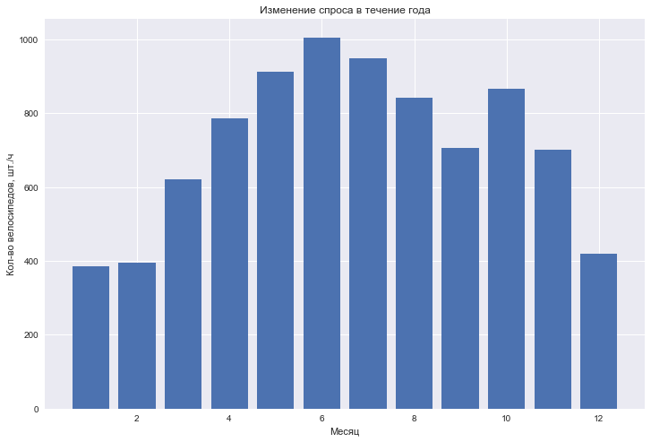

# Анализ и моделирование спроса на услуги по аренде велосипедов в Сеуле

Проводится предварительный анализ данных (EDA) для выявления основных факторов, влияющих на спрос.

Предварительная обработка данных включает генерирование новых параметров, учитывающих сезонные и суточные изменения спроса и долгосрочный тренд, кодировку категорийных параметров и нормирование числовых параметров.

### Параметры с наиболее высокой корреляцией со спросом на аренду велосипедов:
- Температура воздуха
- Час суток
- Температура "точки росы"
- Солнечная радиация

В течение суток прослеживается два явно выраженных пика спроса на аренду велосипедов: наиболее значительный - в вечерние часы (18.00 - в среднем около 1500 шт. в час) и менее значительный - в утренние (8.00 - чуть более 1000 шт. в час).

Исходные данные ограничены по объему и не позволяют в полной мере выявить долгосрочный тренд. Однако очевидно влияние сезонного фактора: в течение года пик спроса на велосипеды приходится на июнь (в среднем около 1000 шт. в час). В октябре также происходит увеличение спроса (в среднем до 850 шт. в час). Наименьший спрос приходится на зимние месяцы (в среднем около 400 шт. в час).

Производится кросс-валидация для выбора оптимальной регрессионной модели, позволяющей прогнозировать объем спроса на аренду велосипедов в зависимости от сезона, времени суток, погодно-климатических условий и других факторов.

### Сравниваемые модели:
- KNN: R2 = 0.791
- Decision Tree: R2 = 0.763
- Gradient Boosting: R2 = 0.845
- Random Forest: R2 = 0.879
- VotingRegressor (Random Forest + Gradient Boosting): R2 = 0.873

### Характеристики датасета:
Объем выборки: 8760

Количество параметров: 14

Параметры:
- Date: дата в формате гггг-мм-дд
- Rented Bike count: количество велосипедов, арендованных за час
- Hour: час суток
- Temperature: температура в градусах Цельсия
- Humidity: влажность воздуха в %
- Windspeed: скорость ветра, м/с
- Visibility: видимость
- Dew point temperature: температура "точки росы" в градусах Цельсия
- Solar radiation: солнечная радиация, MJ/кв. м
- Rainfall: осадки (дождь), мм
- Snowfall: осадки (снег), см
- Seasons: сезон (Winter, Spring, Summer, Autumn)
- Holiday: праздничные дни (Holiday/No holiday)
- Functional Day: рабочие часы (NoFunc - Non Functional Hours, Fun - Functional hours)

Источник данных:
- https://archive.ics.uci.edu/ml/machine-learning-databases/00560/SeoulBikeData.csv
- https://archive.ics.uci.edu/ml/datasets/Seoul+Bike+Sharing+Demand
- http://data.seoul.go.kr/
