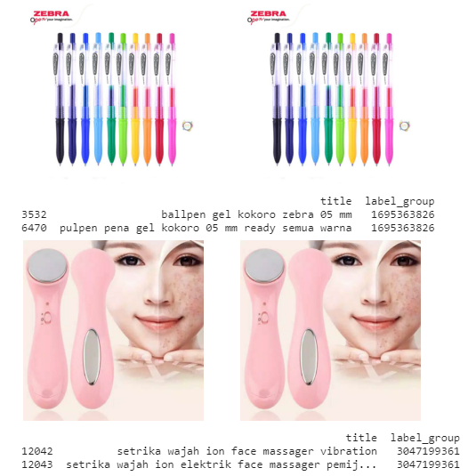
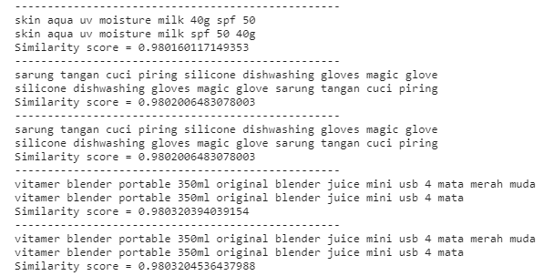
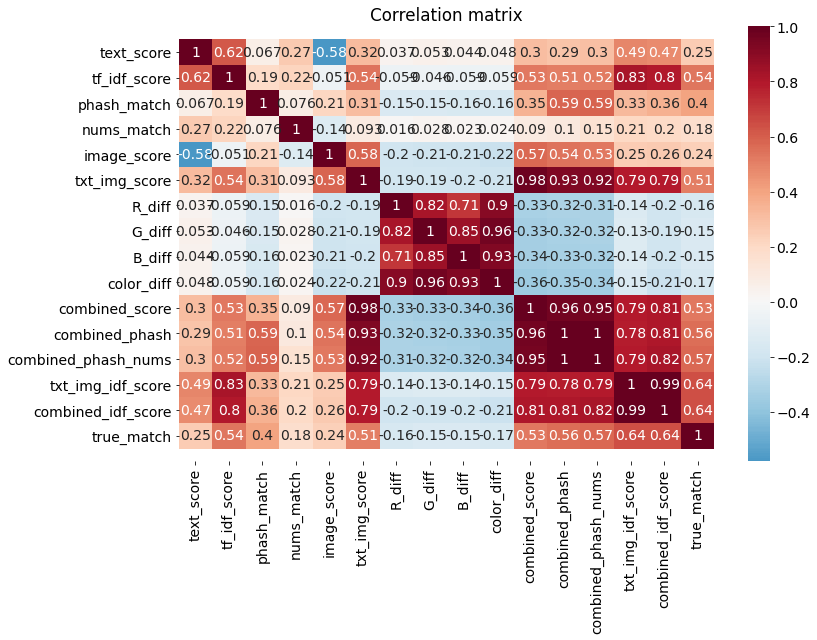
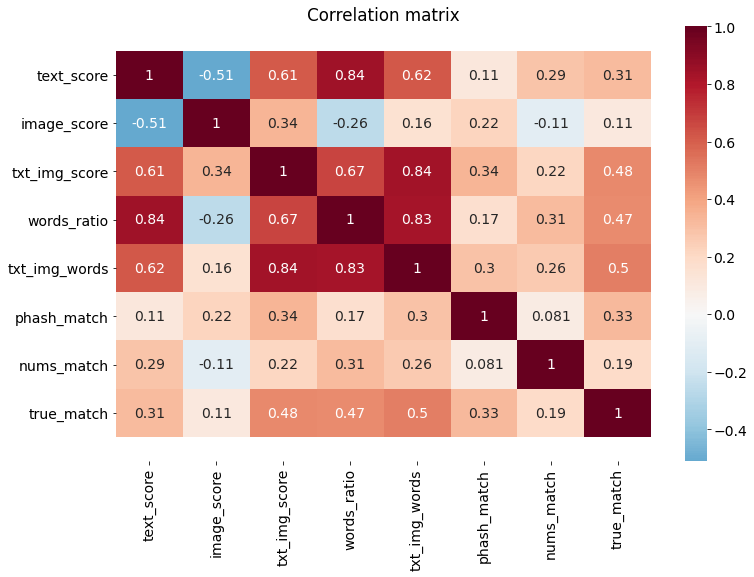

# Поиск товаров-аналогов

Репозиторий содержит примеры кода для подбора товаров-аналогов на основе анализа текстовых описаний и изображений. Исходные данные предоставлены организаторами соревнования "Shoppee - Price Match Guarantee", проводившегося на Kaggle. Финальная версия ноутбука на Kaggle: https://www.kaggle.com/ekaterinadranitsyna/shoppee-sub-version

Данные содержали 34 000 объектов в обучающей выборке и 70 000 объектов в тестовой выборке. По каждому товару в сводной таблице в формате .csv имелись следующие сведения:
- Posting ID (уникальный идентификатор)
- Title (текстовое описание товара)
- Image (название файла с изображением)
- phash (perceptual hash)
- Label group (номер товарной группы)

Товары-аналоги имели одинаковый номер товарной группы. Требовалось разработать алгоритм, который находит во всем объеме имеющихся данных товары-аналоги и добавляет к исходной таблице столбец, в котором перечислены через пробел ID всех товаров той же группы (включая ID самого товара, для которого производится поиск). Товарные группы в обучающей выборке включали от 2 до 50 товаров-аналогов. Значение phash было одинаковым только для части для части товаров-аналогов.

### Примеры пар товаров, найденных по сходству изображений

### Примеры пар товаров, найденных по сходству описаний

Качество решений оценивалось по показателю **F1 score** на тестовой выборке.

**Файл "best_public_score.py"** содержит код, показавший наилучший результат на тестовой выборке организаторов:
- Public leaderboard F1 score = 0.683
- Private leaderboard F1 score = 0.673
- Cross-validation F1 score = 0.702

Для решения поставленной задачи используется бинарная классификация: на основе сравнения параметров товаров составляется список схожих пар, затем ансамбль из нескольких моделей классификации определяет, какие пары являются аналогами.

Краткое описание алгоритма:
- С помощью готовой модели EfficientNetB7 из keras.applications с финальным слоем global average pooling все имеющиеся изображения преобразуются в 1D векторы, содержащие по 2560 параметров.
- С помощью модели Universal sentence encoder все текстовые описания товаров преобразуются в 1D векторы, содержащие 512 параметров.
- Полученные массивы используются для поиска наиболее схожих пар товаров - отдельно на основе текстов и отдельно по изображениям. Для этого применяется заимствованная из библиотеки sentence_transformers функция, модифицированная для данной задачи и позволяющая осуществлять перебор в рамках отдельных сегментов массива, что экономит память.
- Списки наиболее схожих текстов и изображений (для каждой пары имеются индексы и cosine similarity score) объединяются. Такой способ поиска схожих товаров связан с тем, что объекты-аналоги могут быть похожи только по описанию, но иметь разные иллюстрации и наоборот.
- К списку схожих пар товаров добавляются все оставшиеся пары с одинаковым phash - вне зависимости от степени схожести текстов и изображений.
- Образовавшиеся при объединении пропуски заполняются путем обращения к исходным массивам параметров для текстов и изображений и рассчета для них соответсвующего similarity score.
- Для всех найденных потенциальных пар (около 550 000 пар товаров) дополнительно рассчитывается cosine similarity score на основе сравнения TF-IDF векторов текстов.
- Для каждой пары рассчитывается относительная разность средних цветов по 3 цветовым каналам: abs(R1 - R2) / 255, abs(G1 - G2) / 255, abs(B1 - B2) / 255 и средняя разность по всем цветам. Это позволяет идентифицировать пары изображений, где показаны аналогичные товары разных цветов. В контексте поставленной задачи такие товары часто относятся к разным группам.
- Добавляется бинарный параметр на основе phash для каждой потенциальной пары (1 означает идентичный phash, 0 - разный).
- Добавляется бинарный параметр на основе сравнения цифр в текстовых описаниях товаров для каждой потенциальной пары (1 означает одинаковые цифры, 0 - разные). Это позволяет выделить товары, отличающиеся, напрамер, по размеру или весу.
- Добавляются сводные числовые коэффициенты, показывающие степень схожести товаров и получаемые путем перемножения предыдущих коэффициентов.

Финальная модель - VotingClassifier - объединяет модели GaussianNB, RandomForestClassifier и KNeighborsClassifier и принимает в качестве входных данных коэффициенты схожести и бинарные параметры для всех потенциальных пар товаров-аналогов.

**Файл "best_local_score.py"** содержит код, показавший наиболее высокий результат на кросс-валидации на учебной выборке:
- F1 score = 0.753

Описание алгоритма:
- Массивы, полученные путем преобразования текстовых описаний через TF-IDF и с помощью модели Universal sentence encoder, объединяются в общий массив векторов, на основе которого производится поиск потенциальных пар товаров-аналогов.
- Изображения преобразуются в массив векторов с использованием модели EfficientNetB7. На основе полученного массива производится поиск пар схожих товаров.
- Два списка потенциальных пар товаров объединяются и дополняются парами товаров, имеющих аналогичный phash, независимо от степени сходства текстов и изображений.
- Для каждой пары схожих товаров на основе текстовых описаний рассчитывается отношение количества уникальных слов, встречающихся в обоих текстах, к общему количеству уникальных слов в этих двух текстах.
- Добавляется бинарный параметр на основе phash для каждой потенциальной пары (1 означает идентичный phash, 0 - разный).
- Добавляется бинарный параметр на основе сравнения цифр в текстовых описаниях товаров для каждой потенциальной пары (1 означает одинаковые цифры, 0 - разные). Это позволяет выделить товары, отличающиеся, напрамер, по размеру или весу.
- Добавляются сводные числовые коэффициенты, показывающие степень схожести товаров и получаемые путем перемножения предыдущих коэффициентов.

Финальная модель - RandomForestClassifier - принимает в качестве входных данных коэффициенты схожести и бинарные параметры для всех потенциальных пар товаров-аналогов.
