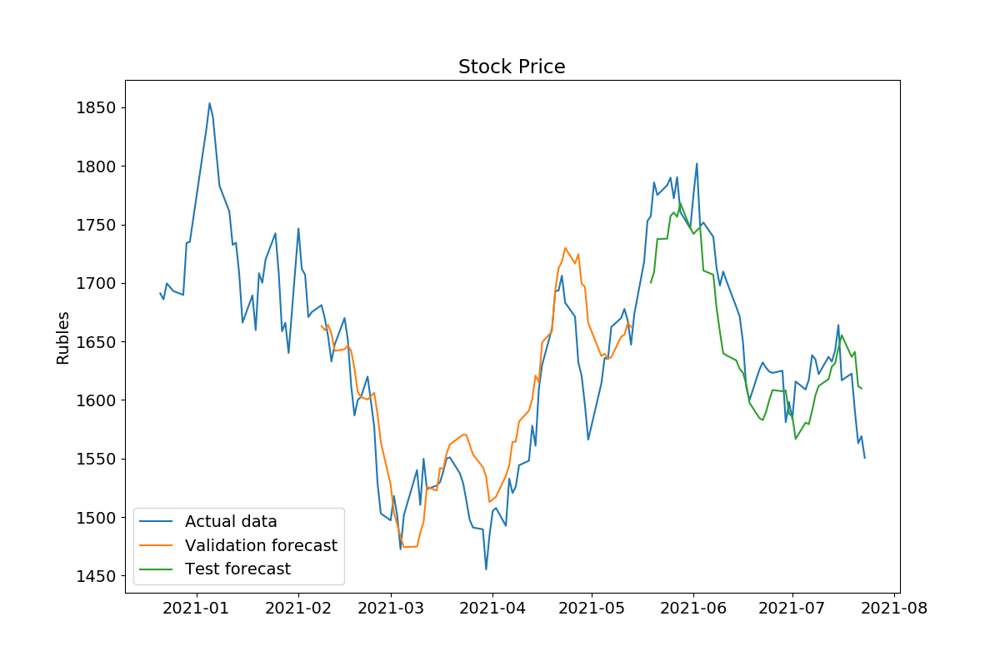

# Прогноз котировок акций компании "Полиметалл" на Мосбирже

Источник данных: ИК "Финам" (https://www.finam.ru/profile/moex-akcii/polymetal-international-plc/export)

Для прогнозов взяты ежедневные значения котировок акций. Прогнозируется цена закрытия торгов. Тестируются модели различной архитектуры (LSTM, Dense NN) и различные наборы входных данных (котировки за предшествующие периоды, котировки и объемы торгов, котировки и технические индикаторы).

Для тестирования моделей используются последние значения временного ряда:
- Общее количество котировок в датасете: 2032
- Количество котировок в учебной выборке: 1911
- Количество котировок в валидационной выборке: 70
- Количество котировок в тестовой выборке: 50

### LSTM модель с одной переменной

Прогноз цены закрытия торгов на основе одной переменной - **предшествующих значений прогнозируемого показателя**. Для прогноза взяты ежедневные значения за **3 предшествующих периода**.

**Средняя ошибка модели составляет около 2%:**
- Test MAPE: 2.0303
- Validation MAPE: 2.8087

### LSTM модель с двумя переменными

Прогноз цены закрытия торгов на основе двух показателей - **предшествующих значений прогнозируемого показателя и объемов торгов**. Для прогноза взяты ежедневные значения за **7 предшествующих периодов**.

**Средняя ошибка модели составляет 3-4%:**
- Test MAPE: 2.9721
- Validation MAPE: 4.0110

### LSTM модель с несколькими переменными

Прогноз цены закрытия торгов на основе **предшествующих котировок** и **технических индикаторов**:
- Цена закрытия торгов
- Изменение котировок за сутки (daily returns)
- Moving Average Convergence-Divergence (MACD)
- Разница между экспоненциальным скользящим средним за 12 и 26 дней
- Relative Strength Index (RSI)
- Верхняя и нижняя границы Bollinger Bands

Для прогноза взяты ежедневные значения за **3 предшествующих периода**.

**Средняя ошибка модели составляет 2.3-2.5%:**
- Test MAPE: 2.3452
- Validation MAPE: 2.5269

### Dense Neural Network (DNN) с несколькими переменными

Прогноз цены закрытия торгов на основе **котировок и технических индикаторов** за **1 предшествующий день**.

**Средняя ошибка модели составляет 1.5%:**
- Test MAPE: 1.5210
- Validation MAPE: 1.5144
