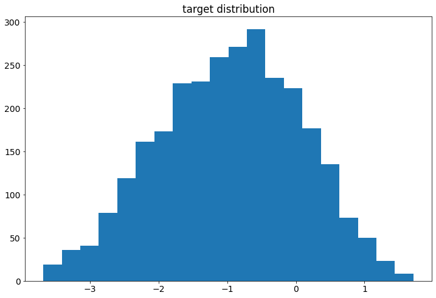
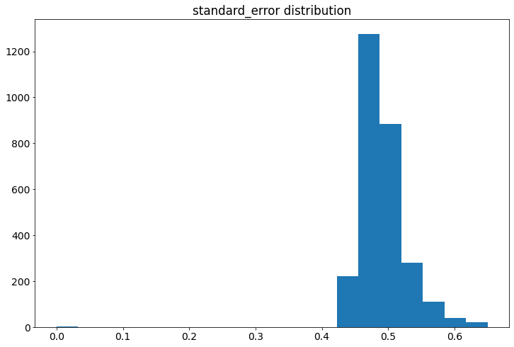

# Языковые модели для оценки сложности текста

Источник данных: https://www.kaggle.com/c/commonlitreadabilityprize
Мой ноутбук на Kaggle: https://www.kaggle.com/ekaterinadranitsyna/text-readability-score

**Задача:** разработать модель для оценки степени сложности текста.

Прогнозируемый параметр (сложность текста) варьировал **от -3.676 до 1.711**, со средним значением -0.959 и медианой -0.912. 

Среднее **стандартное отклонение при оценке текстов экспертами** составляло **0.491**, медиана - 0.485, диапазон - от 0 до 0.65.

### Основные подходы к решению:
- Генерация **статистических показателей** на основе анализа текстов (количество знаков и слов, длина слов и предложений, количество знаков препинания, труднопроизносимых сочетаний букв, редких слов и проч.) и использование регрессионных моделей из **библиотеки sklearn** на основе этих параметров. Средняя ошибка модели: **0.862**.
- Комбинирование статистических параметров текста и векторного представления, полученного из модели **Universal Sentence Encoder**. Средняя ошибка модели: **0.588**.
- Дообучение модели **DistilBERT** и оценка текстов только на основе векторных представлений. Средняя ошибка модели: **0.533**.
