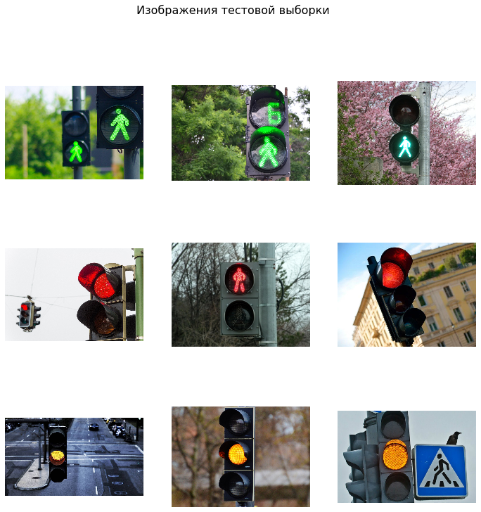

# Классификация изображений уличных светофоров через нейронную сеть

# 

### Создание собственной нейронной сети

Нейронная сеть включает несколько блоков из слоев Conv2D и MaxPooling2D, финальные слои - Flatten и Dense.

### Создание нейронной сети на основе существующей модели

Готовая модель ResNet50 загружается из keras.applications. Финальный слой заменяется новым слоем Dense с 3 нейронами.

### Тестовая выборка

Модели разрабатываются как упрощенные прототипы, поэтому для обучения и тестирования взята ограниченная выборка изображений:
 - Данные для обучения: по 15 изображений в 3 категориях
 - Тестовые данные: по 3 изображения в 3 категориях
