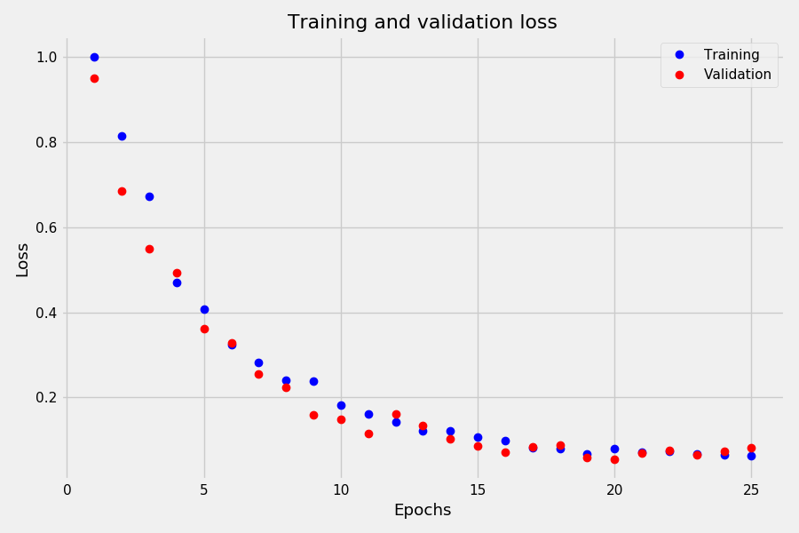
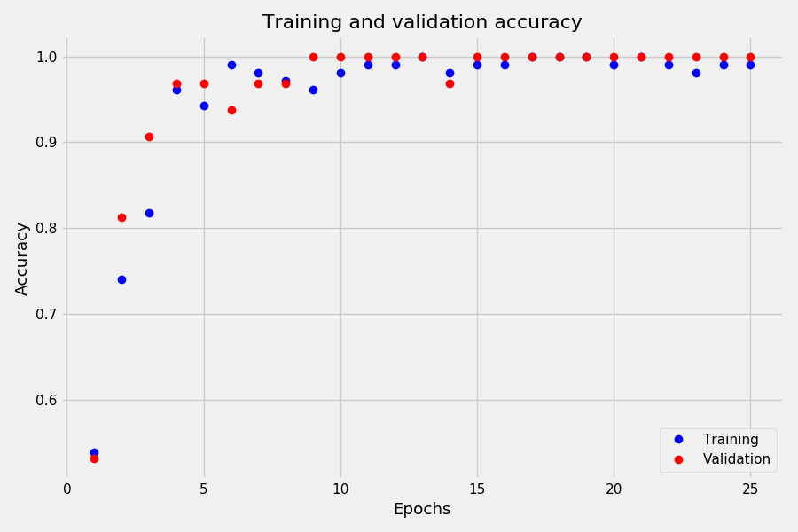

# Модели классификации для "Wine recognition dataset"

### Нейронная сеть

В файле 'wine_classification_TF.py' находится модель классификации на основе нейросети, созданная с применением библиотеки TensorFlow.

Модель включает:
- входной слой с нормализацией исходных числовых данных;
- 2 полносвязных слоя с регуляризацией весов и функцией активации "relu";
- финальный слой с 3 нейронами и функцией активации "softmax".

Поскольку нормализация числовых данных производится внутри модели, сохраненную версию можно в дальнейшем использовать на новых данных, не подвергая из предварительной обработке.

Для автоматической остановки процесса обучения используется инструмент callbacks.EarlyStopping, отслеживающий значения метрики validation loss.

С учетом небольшого размера исходных данных модель очень быстро выходит на высокие показатели точности.

При оценке модели на тестовой выборке достигаются результаты:
- accuracy: 1.0
- loss: 0.07

### Модели sklearn

В остальных файлах формата .py находятся модели классификации из библиотеки sklearn: LogisticRegression, KNN, SVC и GradientBoosting. Для анализа ошибок классификации используется "confusion_matrix", производится расчет показателей "recall_score" и "ROC AUC".

Результаты оценки моделей на тестовой выборке:
- LogisticRegression:
  - Средняя точность: 0.98
  - ROC AUC: 1.0
- GradientBoosting:
  - Средняя точность: 0.93
  - ROC AUC: 0.996
- SVC:
  - Средняя точность: 0.92
- KNN:
  - Средняя точность: 0.64

### Исходные данные

Используются данные из стандартного датасета библиоитеки sklearn - "Wine recognition dataset":
- Количество строк в базе: 178
- Количество параметров: 13
- Количество классов: 3

Перечень параметров:
- Alcohol
- Malic acid
- Ash
- Alcalinity of ash
- Magnesium
- Total phenols
- Flavanoids
- Nonflavanoid phenols
- Proanthocyanins
- Color intensity
- Hue
- OD280/OD315 of diluted wines
- Proline

Распределение данных по классам:
- class_0: 59
- class_1: 71
- class_2: 48
