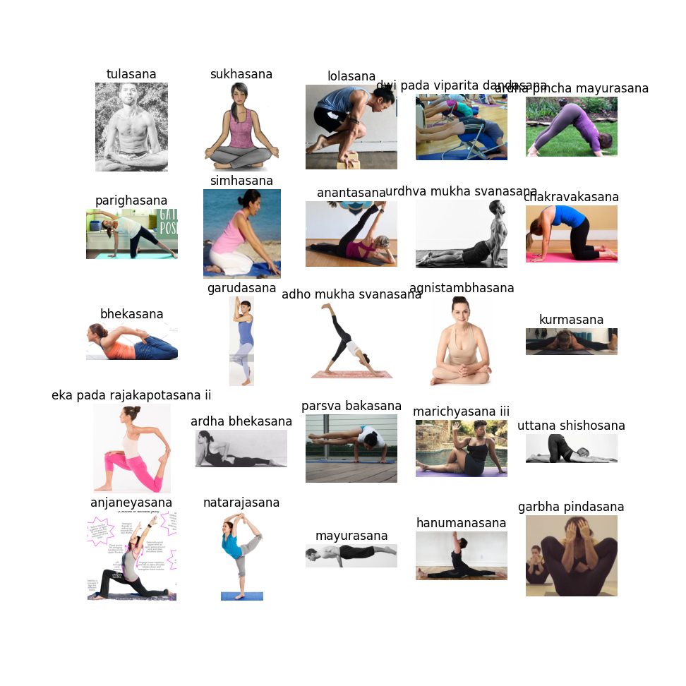
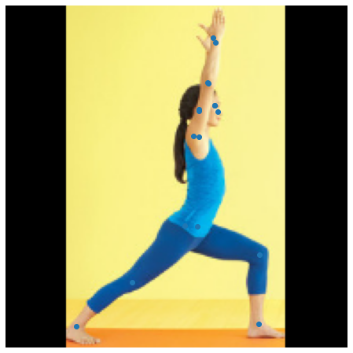
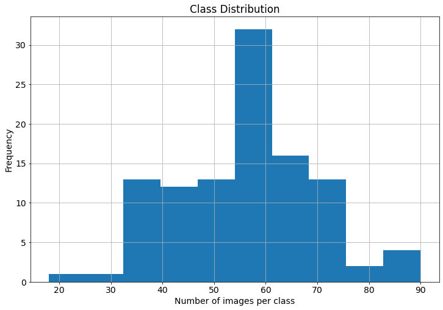
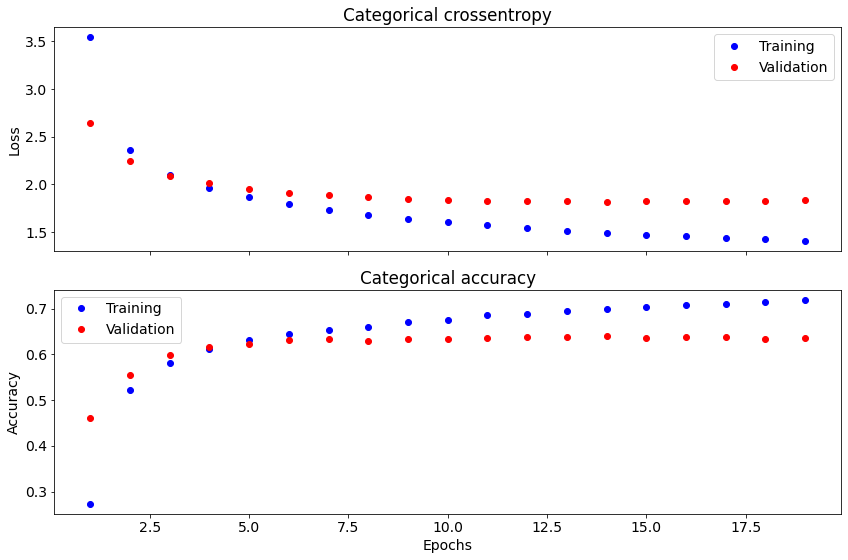

# Модель классификации поз (асан) для йоги

Мой ноутбук на **Kaggle:** https://www.kaggle.com/ekaterinadranitsyna/yoga-poses

Исходные данные с сайта Kaggle (https://www.kaggle.com/shrutisaxena/yoga-pose-image-classification-dataset) содержат около **6,000 изображений**, относящихся к **107 классам**.

### Алгоритм классификации:
- Использование готовой модели для идентификации **17 ключевых точек тела человека** на изображении (feature extraction: для каждой точки модель возращает координаты x и y и confidence score, для обучения нейронной сети используются только координаты x и y)
- Вычисление производных параметров на основе **расстояний между точками** и **относительного расположения** пар точек:
  - евклидово расстояние между парами точек (левая и правая кисти рук, локти, колени, щиколотки, локти и колени попарно и проч.)
  - бинарные значения для выбранных пар точек, кодирующие их пространственное расположение относительно друг друга (выше/ниже - например, щиколотки и бедра)
- Обучение **полносвязной нейронной сети** на основе данных координат ключевых точек и дополнительных пространственных параметров

### Предобученные модели:
- https://tfhub.dev/google/movenet/singlepose/thunder/3 - большая модель для более высокой точности
- https://tfhub.dev/google/movenet/singlepose/lightning/3 - меньшая модель для выболее быстрого инференса

### Особенности и ограничения
Исходные **данные несбалансированы по классам:** количество изображений в классе варьирует **от 18 до 90**. В связи с этим предусмотрена **аугментация исходных изображений (flip left to right)** для удвоения количества снимков.

Модель предназначена для **классификации фотографии одного человека, находящегося в центре кадра**. Однако в исходных данных встречаются единичные фотографии групповых занятий, где в кадре находится несоколько человек, а также изображения не являющиеся фотографиями, что снижает точность модели.

### Результаты:
- При обучении нейросети **только на данных по исходным изображениям и пространственных параметрах** точность модели на валидационной выборке достигает **61%**
- При обучении нейросети **на данных по исходным и обращенным слева-направо изображениям и пространственных параметрах** точность модели на валидационной выборке достигает **68%**

